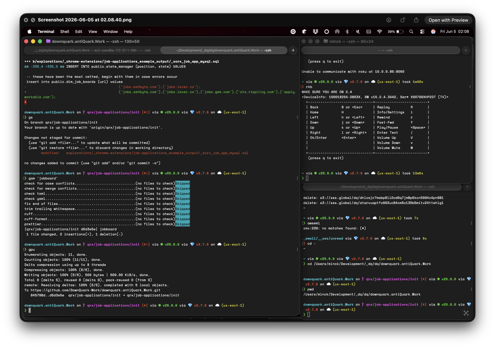
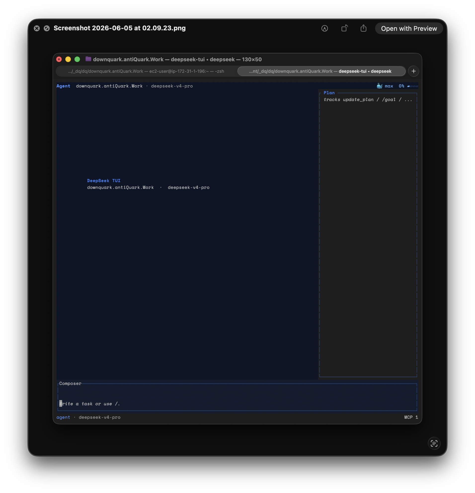

«««
METADATA: nested page metadata
Title: Revamped (G|T)UI :: What It Solves
Author: @mlnck
created: 1694997815138
edited: 1694997815139
»»»

(G|T)UI Usefulness

Currently, if you neeed to run concurrent terminal commands, or even just need to allow one to remain active in the foreground, you are limited to the options available to you.

There are essentially 2 options:

create a new process|hope the developer made a TUI
-|-
|
5 isolated windows to run a single full stack application|an actual TUI! (read below for the not-so-greatness).

Don't be fooled, even applications like `warp` are just shell window managers.
- in the above screenshot, I am running _**5**_ separate, terminal windows to spin up a single full stack application.
- servers have to run
- api's have to listen
- hmr's have to reload hotly
  - and with all windows persisting background processes
- another window is open so I can `cURL` the backend server and get some data a'flowin.

At this point, I _really_ hope I don't need to update a global variable, because I know I 'm going to forget to source at least one of those windows and shenanigans will ensue.

At least we don't have to worry about that with the **DeepSeek** `TUI`.
- after all, we have a single process running 3 main windows without the duplicated overhead.
- background processes can be spun up and shut down without exactly like the application requires.

But there's the rub ... _exactly like **the** application requires__.
- A developer that most people will have never even heard of has decided how you _must_ work with the program.
- _they_ defined the layout
  - hope you have no dead pixels, smudges on the screen, etc
  - I also hope you  work exactly like they do, because no you don't have a choice.
    - the unknown developer now controls what you are allowed to do with something as basic as bash
- The worst though, would be if they _did_ do **everything** exactly like you would have.
  - their pre-defined workflow matches how your brain works 1000%
  - well, unfortunately, the `TUI` can only do tasks related for exactly what it was created for.

1. there is no freedom
2. the developer decides all
3. the user gets what they get

### One and done

 For all we know weeks -> months of work has been put into creating the `TUI`. Then it's released, and 9 times out of 10 the developer using your program is enjoying the benefits you added.
 - But they've also got another terminal window open to interact with their new toy. All because his personal work flow has one step reversed from how you do it.
 - so now, his enjoyment has turned to annoyance because there are multiple steps and variable syncing/sourcing each time they need to work on the program.

 ---

 ## What `(G|T)UI` does

`(G|T)UI` allows the user to define their _own_ `TUI` _**DURING**_ runtime.
They are able to create 5 windows in a `window group`.
- update a global variable, source the `window group`, and all 5 processes are synced.
- don't want all windows to auto-sync?
  - no problem, just sync the`window tab`(s) that should be affected.
  - only the windows/tabs you wish to update, will be updated.

The `UI` will be figured out, but utnil then:
- picture a mini-map in one corner of the terminal window
- a 9 button `compass rose` in another
- and a single window that just spun up a `loclhost` server to await `API` calls

Using the `compass rose` navigation buttons (or shortcut keypresses) you "slide" the terminal viewpoint 25% to the right. The server is still running, but there is a border around it's output, and i the minni-map a `workgroup` is now displaying,

Widthout missing a beat, you send type in a `cURL` request
- the typed text is displayed in the blank 25% of the terminal window.
- you submit the `cURL` and watch the logs start flowing by in the 75% of the same window that has the server running in the foreground
  - uh-oh, the logs are cut off because you "slid" over on the infinite canvas
  - you use the `compass rose` (or `TUI Command Menu`) and the server view has updated to use only 75% of the screen

> There's something big to be seen with the above
> - by default everytime you "slide" all elements keep their initial width/height
>   - but now, as the lowly _end user_ you, who are _**NOT**_ the `program` developer
> - yes **YOU**, have took a step towards creating the `TUI` that **YOU** want
>   - a `TUI` that **YOU** will use

## and _THAT_ is the point

- New layouts can be created for each project
- Or you could reuse the same layout for multiple projects
  - ↑ that's right! ~ remember the `TOML` file from the [TODO Page](./todos.md)?
  - well, the `compass rose` now allows you to save the current layout to that `TOML` file
    - or any other one for that matter (multiple files==multiple saved `TUI` layouts that lowly YOU has created)

The features mentioned here can continue to be expanded on:
- e.g.
  - collapsible `window groups|tabs`
  - `window groups|tabs` that only display as modals if an `error|exit` occurs
    - etc

But _**THAT**_ lowly **YOU** - is exactly why _**YOU**_ want to use this program!

Now, buy me a ~~coffee~~ _beer_.
